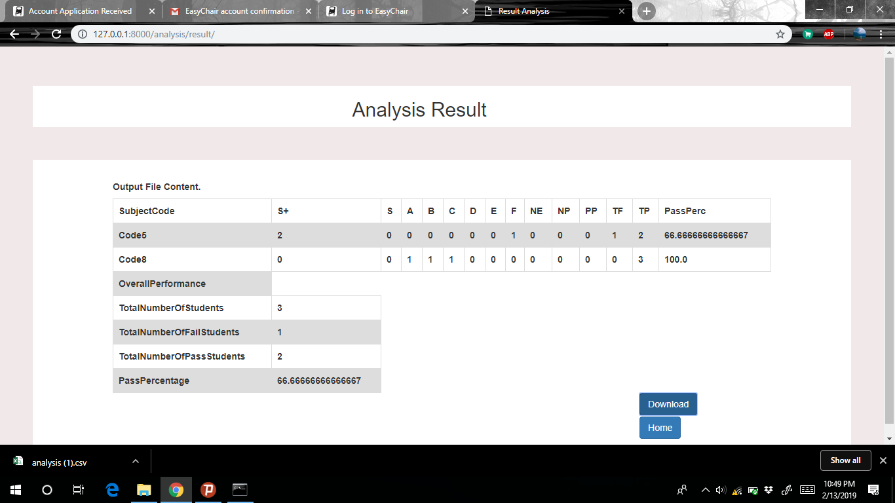

# Result Analysis
### Home Page

Upload the CSV file in this page and click the NEXT button.

### Subject Code Page

Select the subject codes for result analysis and click NEXT button.

### Analysis Result Page

Result will be displayed and you can download it by clicking at Download button.

### Instructions to install and run Django 
1) Install the Django.
2) Open the terminal or cmd prompt.
3) Migrate(Change Directory, cd FolderPath) to the folder resultAnalysis
4) Run the following command: 
	python manage.py runserver
5) Open a tab in browser and search for(enter in address bar): 
	http://127.0.0.1:8000/analysis/home/
	or 
	http://localhost:8000/analysis/home/

### The website's live url
http://result-analysis.herokuapp.com/
